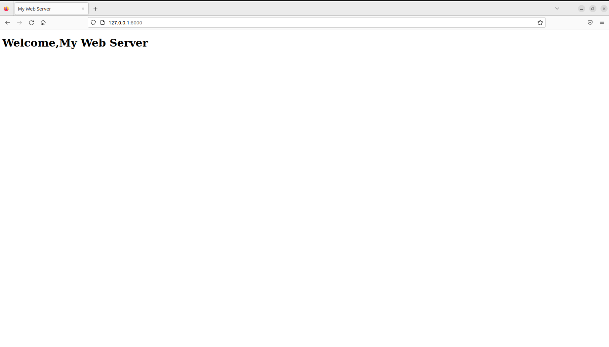

# Developing a Simple Webserver
## AIM:
To develop a simple webserver to serve html pages.

## DESIGN STEPS:
### Step 1: 
HTML content creation
### Step 2:
Design of webserver workflow
### Step 3:
Implementation using Python code
### Step 4:
Serving the HTML pages.
### Step 5:
Testing the webserver

## PROGRAM:
```from http.server import HTTPServer,BaseHTTPRequestHandler

content="""
<!doctype html>
<head>
<title> My Web Server</title>
</head>
<body>
<h1>Welcome,My Web Server</h1>
</body>
</html>
"""

class myhandler(BaseHTTPRequestHandler):
    def do_GET(self):
        self.send_response(200)
        self.send_header('Content-type', 'text/html; charset=utf-8')
        self.end_headers()
        self.wfile.write(content.encode())


server_address=('',8000)
httpd = HTTPServer(server_address,myhandler)
print("running")
httpd.serve_forever()
```


## OUTPUT:


## RESULT:
thus,developed a simple webserver to serve html pages.